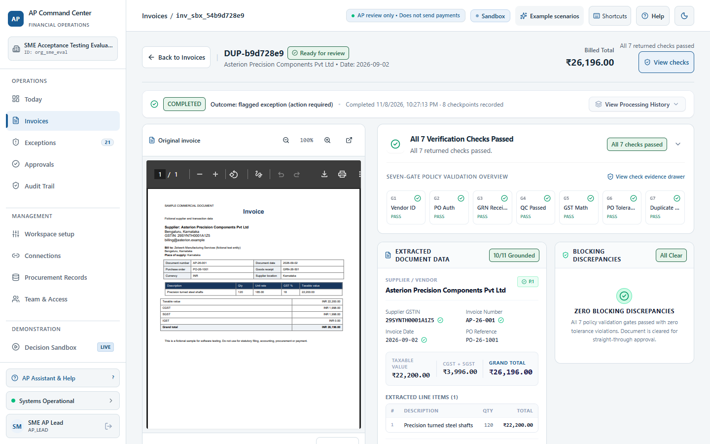
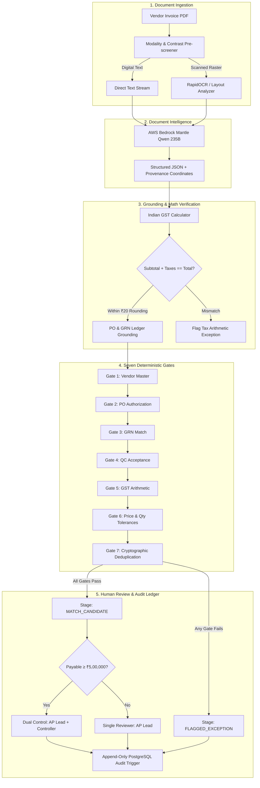

# Autonomous Accounts Payable (AP) Command Center

[](https://python.org)
[](https://fastapi.tiangolo.com)
[](https://react.dev)
[](https://www.typescriptlang.org)
[](https://www.postgresql.org)
[](https://tailwindcss.com)
[](LICENSE)

An AI-assisted accounts payable invoice processing and 3-way matching system built for the **Zamp AI Solutions Associate (Problem Statement 1)** take-home case study.

The application ingests vendor invoices, extracts structured data with multimodal AI, cross-checks line items against procurement and warehouse records (PO, GRN, and QC), evaluates seven deterministic financial policy gates, and routes exceptions for dual-control human review with an immutable database audit trail.

---

### Quick Navigation

- **[Live Application](https://zamp-case-study-ps-1-1.onrender.com/)** — Hosted production deployment on Render
- **[Decision Sandbox](https://zamp-case-study-ps-1-1.onrender.com/sandbox)** — Guided interactive workflow and custom PDF test studio
- **[Evaluator Quick Start (START_HERE.md)](START_HERE.md)** — 3-minute testing path for hiring evaluators
- **[System Architecture (ARCHITECTURE.md)](ARCHITECTURE.md)** — In-depth architectural specification and data flow
- **[Local Setup Guide (docs/LOCAL_SETUP.md)](docs/LOCAL_SETUP.md)** — Step-by-step local development setup
- **[Live Build Liveness Probe](https://zamp-case-study-ps-1-1.onrender.com/api/v1/liveness)** — Container status and Git commit parity

---

## Executive Summary: Operational Workflow & Machine Economics

Accounts payable automation requires balancing automated document processing with financial control:

- **Machine Processing Latency:** ~25–28 seconds end-to-end (PDF ingestion $\rightarrow$ AWS Bedrock Mantle Qwen 235B multimodal extraction $\rightarrow$ deterministic 7-gate validation).
- **Direct Model Inference Cost:** ~$0.0022 USD (~₹0.18) in Bedrock token usage per processed invoice (excluding cloud database hosting and human review labor).
- **Workflow Role Shift:** Instead of manually re-keying invoice headers and line items into an ERP and performing manual math checks against POs and warehouse GRNs, the AP reviewer acts as an exception manager—inspecting pre-reconciled items with coordinate-anchored provenance and handling commercial discrepancies.

---

## Core Edge Cases & Decision Scenarios (The Six Sandbox Scenarios)

The application evaluates realistic accounts payable edge cases across six pre-seeded commercial scenarios in the Decision Sandbox:

| Scenario | Document Reference | Target Stage & Decision | Operational Failure & Invariant |
| :--- | :--- | :--- | :--- |
| **`SCN-01` Clean 3-Way Match** | `01_invoice_AP_26_001.pdf`<br>(₹26,196.00) | `MATCH_CANDIDATE`<br>(`PENDING_APPROVAL`) | **Happy Path:** Contracted rate ₹185.00 matched exactly across 120 units against PO-26-1001, GRN-26-501, and QC certificate #QC-GRN-26-501-01 with 0.00% variance. All 7 gates pass. |
| **`SCN-02` Price & Qty Variance** | `30_invoice_AP_26_011.pdf`<br>(₹25,960.00) | `FLAGGED_EXCEPTION`<br>(`ACTION_REQUIRED`) | **Tolerance Breached:** Supplier bills unit price ₹220.00 vs PO rate ₹185.00 (+18.92% variance vs 1.5% limit) and bills 100 units vs 80 accepted on GRN-26-621. Fails Gate 6 and Gate 3. |
| **`SCN-03` Low-Contrast Scan** | `36_invoice_POS_26_112.pdf` | `FLAGGED_EXCEPTION`<br>(`ACTION_REQUIRED`) | **Fail-Closed Safety:** Challenging raster scan with zero native text and poor contrast ($\sigma < 10.0$). Grounding tripwire halts processing to prevent ungrounded AI hallucinations. |
| **`SCN-04` QC Inspection Hold** | `11_invoice_MC_26_090.pdf`<br>(₹1,92,576.00) | `FLAGGED_EXCEPTION`<br>(`ACTION_REQUIRED`) | **Defective Goods Guard:** Factory goods receipt GRN-26-603 has inspection status `HOLD`. Fails Gate 4 deterministically, blocking payment on defective materials. |
| **`SCN-05` Non-Payable Receipt** | `38_payment_receipt_RCPT_26_088.pdf`<br>(₹2,500.00) | `QUARANTINED`<br>(`QUARANTINED`) | **Document Classification:** Multimodal AI classifies file as `PAYMENT_RECEIPT` acknowledging prior payment. Autonomously isolated with zero AP liability registered. |
| **`SCN-06` Duplicate Resubmission** | `01_invoice_AP_26_001.pdf` | `REJECTED` / `409`<br>(`ACTION_REQUIRED`) | **Dual-Tier Deduplication:** Identical voucher number or SHA-256 hash collision with active ledger record. Fails Gate 7 deterministically, preventing duplicate disbursements. |

### Decision Taxonomy & Resolution Actions
Rather than an unranked binary pass/fail, the engine computes three distinct operational states:
- **`MATCH_CANDIDATE` (Straight-Through Recommendation):** All 7 deterministic gates pass with 0.00% variance. Recommended for 1-click AP Lead approval.
- **`FLAGGED_EXCEPTION` (Granular Policy Violation):** Records specific failure reason codes (e.g. Gate 6 Rate Spike $+18.92\%$, Gate 4 Defective Goods QC Hold, or Gate 2 PO Overrun) and routes to human reviewer with audit-tracked actions: `APPROVE_AP_REVIEW`, `HOLD_PENDING_EVIDENCE`, or `REJECT_INVOICE`.
- **`QUARANTINED` (Non-Payable Commercial Document):** Autonomously isolates documents classified as payment receipts, account statements, or corrupt files with zero liability created in the accounts payable ledger.

---

## Visual Showcase

### Two-Column Invoice Review Workspace
The flagship interface provides side-by-side verification: the original document rendered on the left, with extracted line items, 3-way reconciliation, and deterministic gate results on the right.



### Seven Deterministic Policy Gates
Every invoice is evaluated against seven sequential checks before any payment recommendation can be generated.


---

## Evaluator Quick Start (3-Minute Live Verification)

Evaluators can test the end-to-end pipeline on the live deployment without configuring local environments or authoring personal mailbox permissions:

1. **Launch Workspace:**  
   Open the **[Live Deployment](https://zamp-case-study-ps-1-1.onrender.com/)** and click **Launch Live Demo Workspace** (or jump directly to the **[Decision Sandbox](https://zamp-case-study-ps-1-1.onrender.com/sandbox)**).
2. **Run a Clean 3-Way Match:**  
   In the Decision Sandbox, select **Option B: Custom PDF Upload**. Click **Download clean invoice**, then upload the resulting PDF. Follow the live processing stages (Ingestion $\rightarrow$ AI Extraction $\rightarrow$ Tax Validation $\rightarrow$ 7 Policy Gates). The job completes with decision `MATCH_CANDIDATE`.
3. **Test an Exception (Rate Variance):**  
   Click **Download price-variance invoice** and upload it. The pipeline detects that the billed rate (₹220.00/unit) exceeds the contracted PO rate (₹185.00/unit) beyond the 1.5% tolerance, failing Gate 6 and routing to `FLAGGED_EXCEPTION`.
4. **Test Cryptographic Deduplication:**  
   Re-upload the exact same PDF file. The system computes the SHA-256 hash at the boundary, detects an identical document in the ledger, and rejects it with `HTTP 409 Conflict`.

> [!NOTE]  
> **Cold Start Notice:** The live demo is hosted on Render's web service tier. If the instance has been idle, the initial page load may take 20 to 40 seconds while the container initializes. Subsequent requests respond within normal operational latencies.

> [!IMPORTANT]  
> **Prepared Records vs. Live Provider Runs:** The demo workspace contains six pre-seeded synthetic records (`SCN-01` through `SCN-06`) for immediate interface exploration. Custom PDF uploads in Option B invoke the live processing pipeline (AWS Bedrock Mantle Qwen 235B and Supabase PostgreSQL).

> [!NOTE]  
> **Synthetic Test Invoices vs. Diverse Layouts:** Option B provides downloadable synthetic invoices to give evaluators a reproducible test flow without exposing confidential third-party corporate data. The model extraction and grounding pipeline was developed and evaluated against a 40-document Indian AP corpus with varied table layouts and degraded scans (`tests/evaluation_corpus_v2/`).

---

## Architectural Principles: "Models Read, Rules Decide"

Accounts payable automation requires balancing flexible document interpretation with zero-tolerance financial accuracy. Large language models excel at parsing unstructured invoices, varying table layouts, and misaligned tokens. However, probabilistic models must never calculate tax totals, determine policy tolerances, or authorize disbursements.


```mermaid
flowchart TD
    subgraph Intake ["1. Document Ingestion"]
        PDF[Vendor Invoice PDF] --> Prescreen[Modality & Contrast Pre-screener]
        Prescreen -->|Digital Text| FastPath[Direct Text Stream]
        Prescreen -->|Scanned Raster| OCRPath[RapidOCR / Layout Analyzer]
    end

    subgraph Intelligence ["2. Document Intelligence"]
        FastPath --> Mantle[AWS Bedrock Mantle Qwen 235B]
        OCRPath --> Mantle
        Mantle --> ExtractedData[Structured JSON + Provenance Coordinates]
    end

    subgraph Grounding ["3. Grounding & Math Verification"]
        ExtractedData --> TaxEngine[Indian GST Calculator]
        TaxEngine --> GSTCheck{Subtotal + Taxes == Total?}
        GSTCheck -->|Within ₹20 Rounding| ProcurementGrounding[PO & GRN Ledger Grounding]
        GSTCheck -->|Mismatch| FlagTax[Flag Tax Arithmetic Exception]
    end

    subgraph PolicyGates ["4. Seven Deterministic Gates"]
        ProcurementGrounding --> Gate1[Gate 1: Vendor Master]
        Gate1 --> Gate2[Gate 2: PO Authorization]
        Gate2 --> Gate3[Gate 3: GRN Match]
        Gate3 --> Gate4[Gate 4: QC Acceptance]
        Gate4 --> Gate5[Gate 5: GST Arithmetic]
        Gate5 --> Gate6[Gate 6: Price & Qty Tolerances]
        Gate6 --> Gate7[Gate 7: Cryptographic Deduplication]
    end

    subgraph Governance ["5. Human Review & Audit Ledger"]
        Gate7 -->|All Gates Pass| MatchCandidate[Stage: MATCH_CANDIDATE]
        Gate7 -->|Any Gate Fails| ExceptionStage[Stage: FLAGGED_EXCEPTION]
        MatchCandidate --> DualControl{Payable ≥ ₹5,00,000?}
        DualControl -->|Yes| RequireTwoSigners[Dual Control: AP Lead + Controller]
        DualControl -->|No| SingleSigner[Single Reviewer: AP Lead]
        RequireTwoSigners --> AppendAudit[Append-Only PostgreSQL Audit Trigger]
        SingleSigner --> AppendAudit
        ExceptionStage --> AppendAudit
    end
```

### The Seven Deterministic Policy Gates

| Gate | Validation Rule | Deterministic Check | Exception Condition |
| :---: | :--- | :--- | :--- |
| **1** | **Vendor Master** | Supplier GSTIN, PAN, and active status exist in the ERP vendor registry. | Unregistered vendor or mismatched tax identifier. |
| **2** | **PO Authorization** | PO reference is valid, approved, unexpired, and has an open line balance. | Closed PO, missing authorization, or unapproved amendment. |
| **3** | **GRN Match** | Billed item quantities do not exceed accepted warehouse Goods Receipt Notes. | Billed quantity > warehouse received quantity. |
| **4** | **QC Acceptance** | Delivered goods have passed engineering quality inspection. | Inspection status is `HOLD` or `REJECTED`. |
| **5** | **GST Arithmetic** | Billed math satisfies $\text{abs}(\text{Subtotal} + \text{Taxes} - \text{Total}) \le ₹20.00$ (statutory per-line rounding margin under Section 170 CGST Act) and line math $\text{qty} \times \text{rate} \approx \text{line\_total}$, validating intrastate vs interstate tax types. | Tax calculation discrepancy or invalid state code mapping. |
| **6** | **Tolerances** | Unit price variance $\le 1.50\%$ (relative contracted rate tolerance); quantity within PO authorized balance and accepted warehouse GRN. | Billed unit rate exceeds contracted purchase order rate by >1.50%, or quantity exceeds authorized PO balance. |
| **7** | **Deduplication** | Dual-tier check: Tier 1 SHA-256 binary hash collision + Tier 2 commercial composite key `(normalized_supplier, normalized_invoice_number)` matching across re-exported or altered PDFs. | Duplicate payment submission or identical re-transmission. |

---

## Core Engineering Decisions

1. **Arbitrary-Precision Balance Accounting:**  
   Uses Python `Decimal` and PostgreSQL `numeric(15,2)` for ledger balances, total amounts, and cumulative PO drawdowns, eliminating floating-point rounding drift. Percentage calculations (e.g. rate variance $\le 1.50\%$) use floating-point arithmetic.
2. **Indian Statutory GST Validation:**  
   Validates supplier GSTIN presence against ERP vendor master, cross-references Karnataka (`29`) intrastate transactions to prevent improper interstate IGST billing, and verifies that $\text{abs}(\text{Subtotal} + \text{Taxes} - \text{Total}) \le ₹20.00$ accommodating statutory per-line rounding under Section 170 of the CGST Act.
3. **Database-Level Audit Immutability:**  
   Financial audit events are written to `audit_events`. Immutability is enforced at the database engine level via PostgreSQL trigger `trg_audit_events_immutable`, which aborts any `UPDATE` or `DELETE` statement. Corrections require new compensating ledger events.
4. **Tenant Isolation via PostgreSQL RLS:**  
   Multi-tenant security uses PostgreSQL Row-Level Security (RLS) forced across all tables. Queries set transaction-local configuration (`SET LOCAL app.current_org_id`), and connection poolers execute `RESET ALL` upon check-in to prevent cross-tenant session leakage.
5. **High-Value Dual-Control Workflow:**  
   Invoices with a net payable balance $\ge ₹5,00,000$ mandate secondary approval by a Financial Controller following initial sign-off by the AP Lead. Anti-self-approval rules prevent the initial approver from granting secondary clearance.

---

## Integration Status & Boundaries

To ensure complete clarity during evaluation, current integration boundaries are explicitly documented:

| Subsystem | Status | Details & Implementation Scope |
| :--- | :---: | :--- |
| **AWS Bedrock Mantle (Qwen 235B)** | **Live** | Active in `ap-south-1` (Mumbai). Zero-temperature structured extraction with fallback handling. |
| **Supabase PostgreSQL 15 & Storage** | **Live** | Production database and private S3-compatible document storage using 300s presigned URLs. |
| **Gmail Mailbox Ingestion** | **Configured** | Code implements OAuth 2.0, Fernet token encryption, Pub/Sub webhook receiver, and history sync. Mailbox OAuth consent is omitted from the public demo to avoid requiring evaluator personal credentials. |
| **SAP S/4HANA ERP Synchronization** | **Roadmap** | Procurement records are grounded against internal database models (`erp.py`). Direct bidirectional RFC/BAPI synchronization is an architectural roadmap item. |
| **Banking & Payment Rails** | **Decoupled** | The application governs accounts payable review and approval. Internal sign-off does not trigger disbursement or initiate automated bank transfers. |

---

## Testing & Verification Summary

The codebase is protected by automated tests across security invariants, matching gates, tenant isolation, and UI responsiveness:

- **40-Document Indian AP Corpus Evaluation:** Evaluated across 40 distinct commercial documents (`tests/evaluation_corpus_v2/` and `full_40_evaluation_report.json`), executing 38 live AWS Bedrock Mantle Qwen 235B calls ($0.045 total inference cost, ~3.0s median model latency), covering credit/debit notes, proforma invoices, e-invoices, reverse charge, foreign currency imports, delivery challans, and degraded low-contrast scans.
- **Python Pytest Suite:** 278 test functions collecting **625 test cases** across unit, security (RLS, audit immutability), parity, and engine phases in `tests/`. (43 skipped tests correspond to disposable local PostgreSQL container runners and live external Gmail network probes).
- **Frontend Test Suite:** 20 automated Node.js test suites in `frontend/` verifying authentication lifecycle (14 tests) and live run polling state machines (6 tests).
- **Responsive Viewport Audit:** 44 automated viewport checks across 9 device widths (320px to 1920px), verifying responsive layout rendering.
- **Live Acceptance Suite:** 9 end-to-end browser tests executed via Playwright against the live Render deployment (`https://zamp-case-study-ps-1-1.onrender.com/`), confirming:
  - 1-click demo workspace launch (11.05s)
  - Fresh clean invoice upload to `MATCH_CANDIDATE` (28.03s)
  - Price variance upload to `FLAGGED_EXCEPTION` (26.74s)
  - Cryptographic duplicate rejection (`HTTP 409 Conflict`)
  - Container build parity matching Git commit `9354d404cad4`
- **Milestone Baseline Snapshot:** An earlier development baseline recorded 464 passed / 43 skipped across 507 collected tests. Subsequent test suite expansion across edge cases, parity testing, and isolation hardening brought the collection to 625 items.

---

## Repository Structure

```
├── backend/                       # FastAPI application & REST endpoints
│   ├── api/v1/                   # Route handlers (auth, invoices, dashboard, webhooks)
│   ├── core/                     # Infrastructure (config, database, security, storage)
│   ├── models/                   # SQLAlchemy domain models (invoice, enterprise, erp, audit)
│   └── migrations/               # Alembic database schema migrations
│
├── frontend/                      # React 19 / Vite single-page application
│   ├── src/pages/                # Primary views (Dashboard, Inbox, Review Workspace)
│   ├── src/components/           # Reusable UI components & authentication views
│   └── public/sandbox.html       # Standalone interactive Decision Sandbox
│
├── engine/                        # Provider-independent business logic
│   ├── mantle_client.py          # AWS Bedrock Mantle client (Qwen 235B)
│   ├── indian_tax_rules.py       # GST arithmetic & 7-gate matching engine
│   ├── duplicate_detector.py     # Cryptographic SHA-256 deduplication
│   └── ocr_engine.py             # PDF text extraction & contrast pre-screening
│
├── docs/                          # In-depth architectural & operational documentation
│   ├── assets/screenshots/       # High-resolution application screenshots
│   ├── AP_BUSINESS_RULES.md      # Detailed 7-gate specifications & GST formulas
│   └── LOCAL_SETUP.md            # Local developer installation guide
│
├── fixtures/                      # Synthetic vendor invoices & ERP reference datasets
├── tests/                         # Pytest test suite (Phases A–E, engine, parity)
├── Dockerfile                     # Multi-stage production container build
├── render.yaml                    # Render Web Service blueprint
└── requirements.txt               # Locked Python dependencies
```

---

## Documentation Index

| Topic | Document | Focus Area |
| :--- | :--- | :--- |
| **Evaluator Walkthrough** | **[START_HERE.md](START_HERE.md)** | Step-by-step 3-minute evaluation guide and live test instructions |
| **Architecture Specification** | **[ARCHITECTURE.md](ARCHITECTURE.md)** | System context, data models, and technical design decisions |
| **AP Business Rules** | **[docs/AP_BUSINESS_RULES.md](docs/AP_BUSINESS_RULES.md)** | Exact GST calculations, tolerance thresholds, and state transitions |
| **Local Development** | **[docs/LOCAL_SETUP.md](docs/LOCAL_SETUP.md)** | Prerequisites, local PostgreSQL, and running frontend/backend servers |
| **Operations Runbook** | **[OPERATIONS_RUNBOOK.md](OPERATIONS_RUNBOOK.md)** | Deployment triage, health check probes, and monitoring guides |
| **Security Architecture** | **[SECURITY_NOTES.md](SECURITY_NOTES.md)** | PostgreSQL RLS policies, audit immutability, and token governance |
| **Contributing Standards** | **[CONTRIBUTING.md](CONTRIBUTING.md)** | Coding conventions, commit guidelines, and security requirements |
| **License** | **[LICENSE](LICENSE)** | Open-source MIT License terms |
